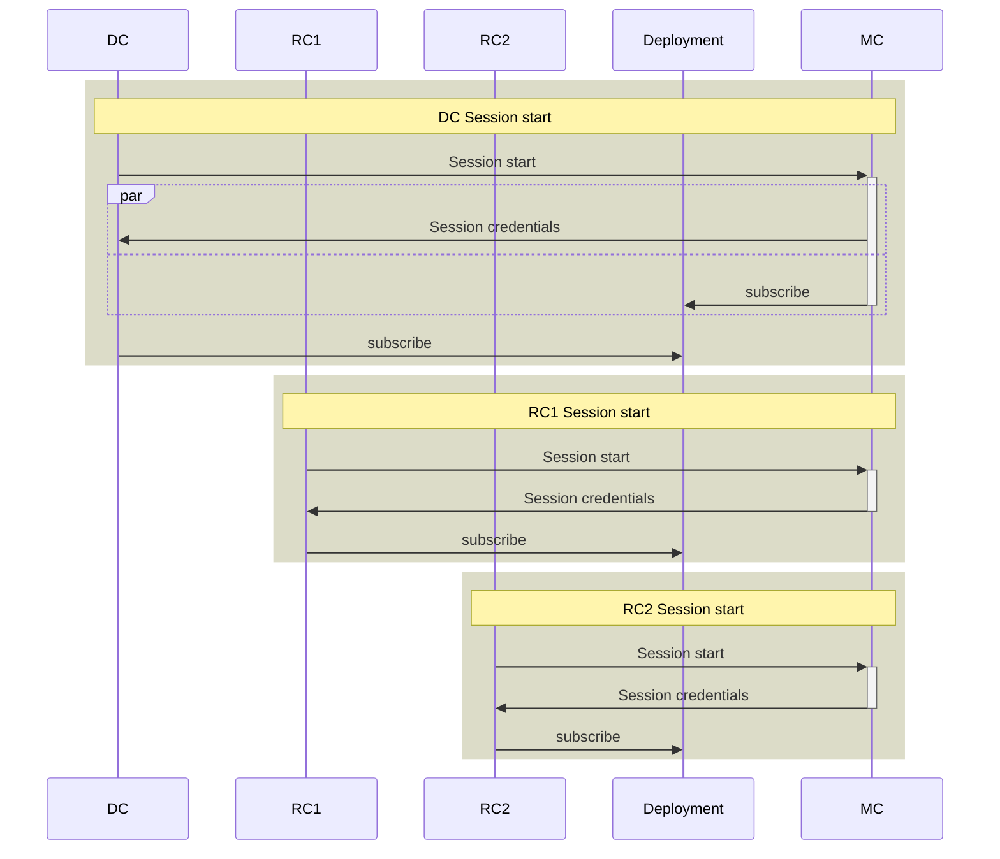

```mermaid

sequenceDiagram
participant DC
participant RC1

participant RC2

participant DD as Deployment

participant MC

rect rgb(220,220,200)

note over DC, MC: DC Session start

DC ->>+ MC: Session start

par

MC ->> DC: Session credentials

and

MC ->>- DD: subscribe

end

DC ->> DD: subscribe

end

  

rect rgb(220,220,200)

note over RC1,MC: RC1 Session start

RC1 ->>+ MC: Session start

MC ->>- RC1: Session credentials

RC1 ->> DD: subscribe

end

  

rect rgb(220,220,200)

note over RC2, MC: RC2 Session start

RC2 ->>+ MC: Session start

MC ->>- RC2: Session credentials

RC2 ->> DD: subscribe

end
```